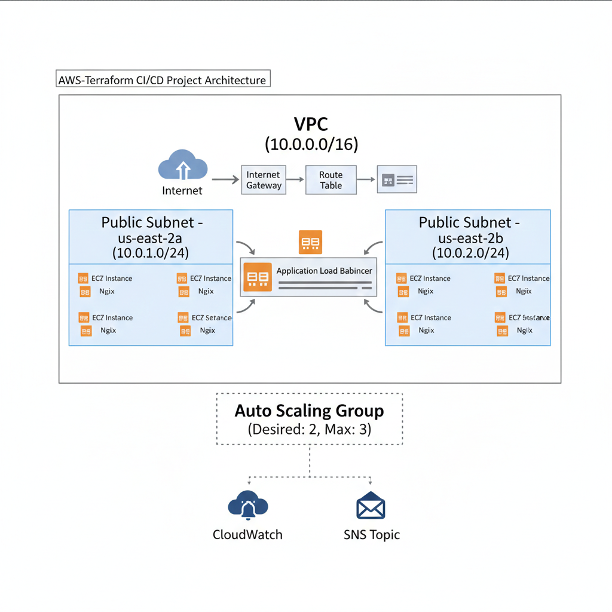

---

# AWS Infrastructure Automation with Terraform & GitHub Actions

This project demonstrates a fully automated CI/CD pipeline for deploying a high-availability web application on AWS using Terraform.

## 🚀 Features

* **VPC & Networking:** Custom VPC with public subnets across 2 Availability Zones (us-east-2a & us-east-2b).
* **High Availability:** Application Load Balancer (ALB) to distribute traffic and Auto Scaling Group (ASG) to manage EC2 instances automatically.
* **Automation:** Full CI/CD via GitHub Actions for automated infrastructure deployment on every code push.
* **State Management:** Secure remote backend using AWS S3 and DynamoDB for state locking to prevent concurrent execution.
* **Monitoring & Alerts:** Integrated CloudWatch Alarms and SNS (Simple Notification Service) for real-time email notifications on infrastructure changes or health issues.

## 📸 Architecture Diagram

This diagram illustrates the high-availability setup including the VPC, Public Subnets across two Availability Zones, the Application Load Balancer, and the Auto Scaling Group.

---

## 🛠️ Tech Stack

* **Cloud:** AWS (EC2, VPC, ALB, ASG, S3, DynamoDB, CloudWatch, SNS)
* **IaC:** Terraform
* **CI/CD:** GitHub Actions
* **Web Server:** Nginx

## 🏗️ Project Structure

* `main.tf`: Core infrastructure components (VPC, Subnets, ALB, ASG).
* `providers.tf`: AWS and Terraform backend configuration.
* `variables.tf`: Reusable variables for the project.
* `.github/workflows/deploy.yml`: GitHub Actions pipeline configuration.

## 🏁 How it Works

1. **Push Code:** Developer pushes Terraform code to the `main` branch.
2. **GitHub Actions:** The workflow triggers, running `terraform init`, `plan`, and `apply`.
3. **Infrastructure Creation:** AWS resources are provisioned/updated automatically.
4. **Health Monitoring:** CloudWatch monitors the ASG; if an instance fails, it triggers an SNS notification to your email.

---

